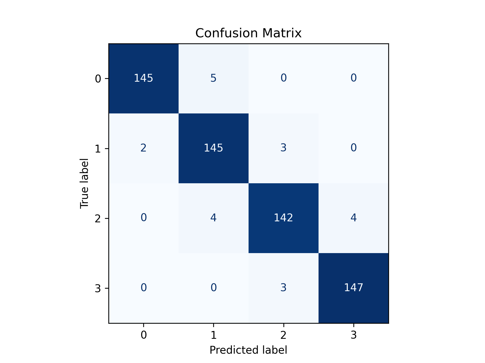
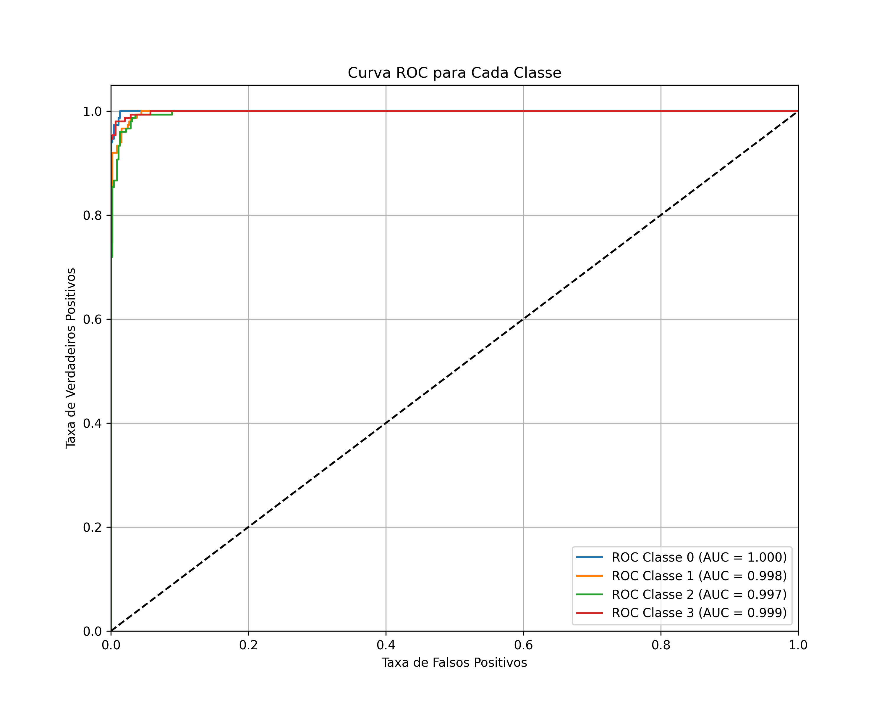
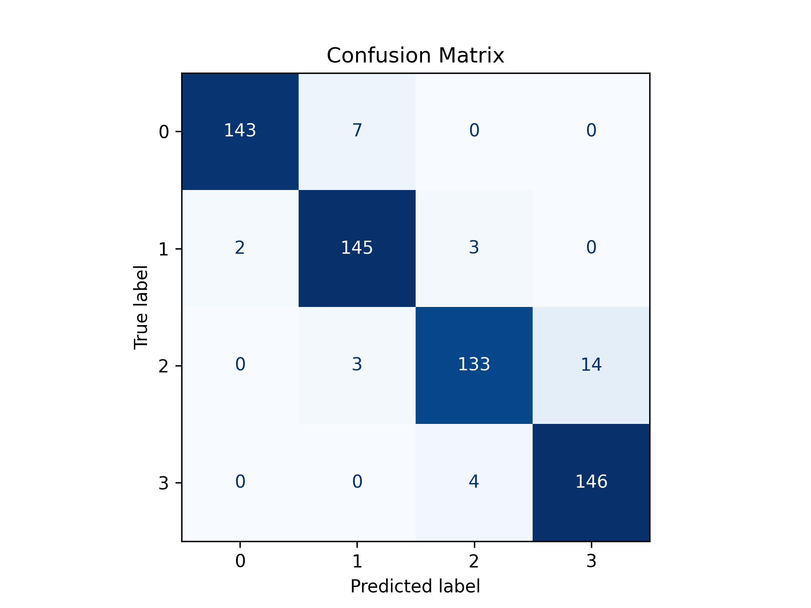
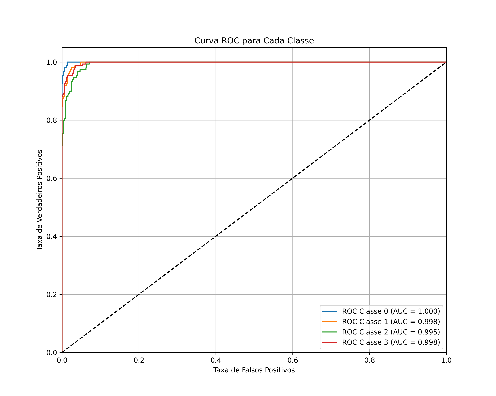
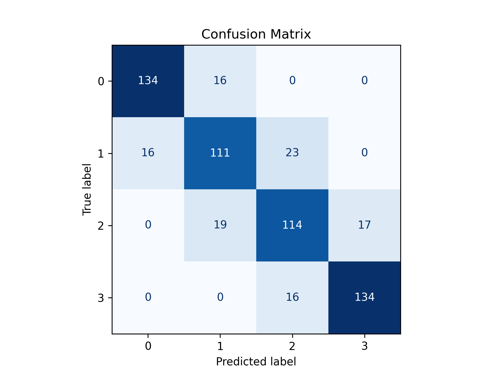
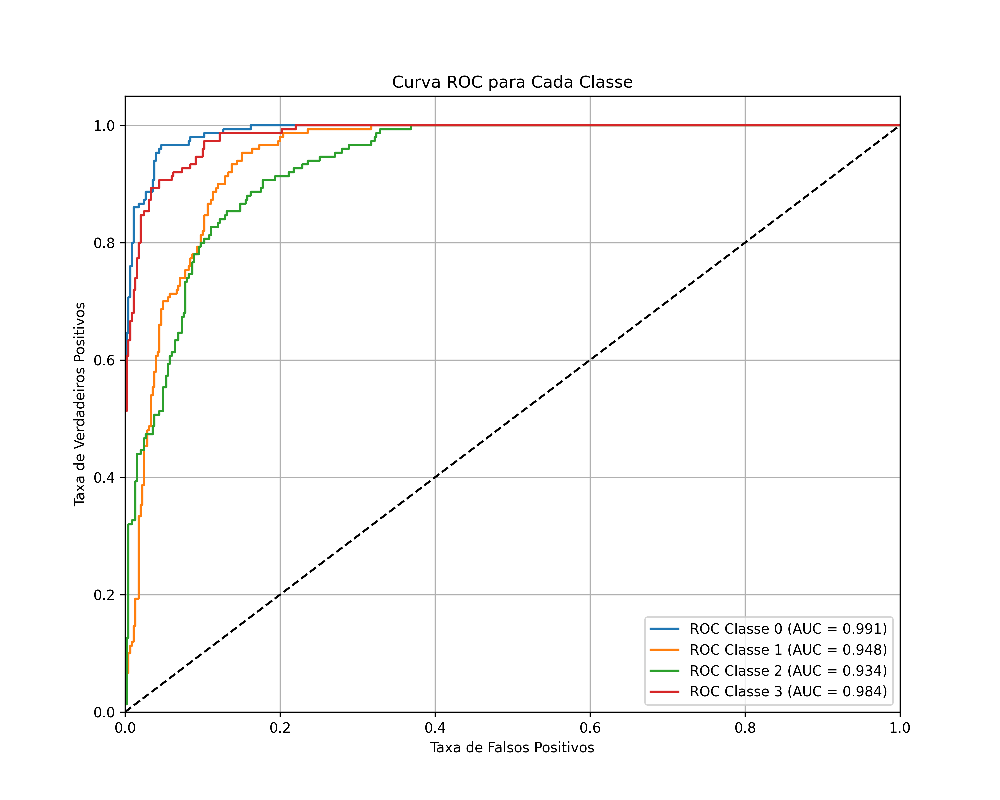
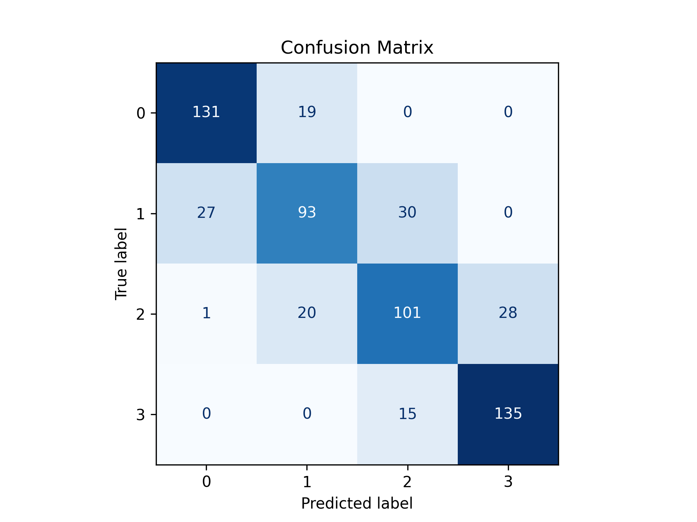
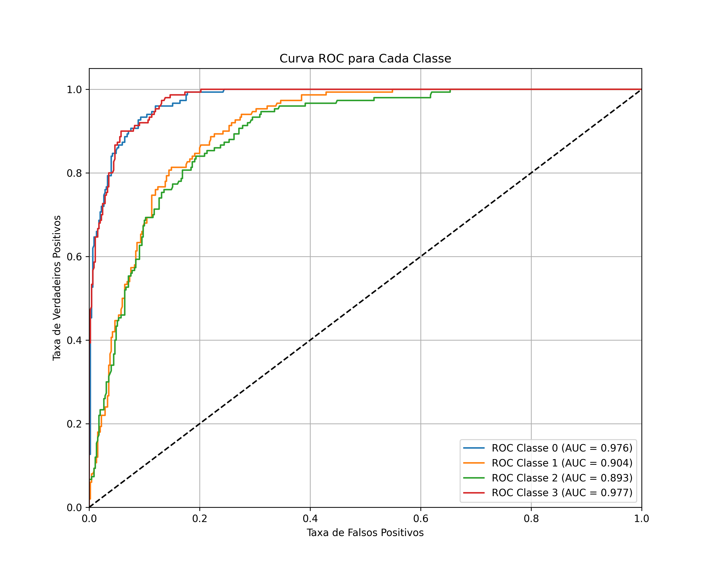
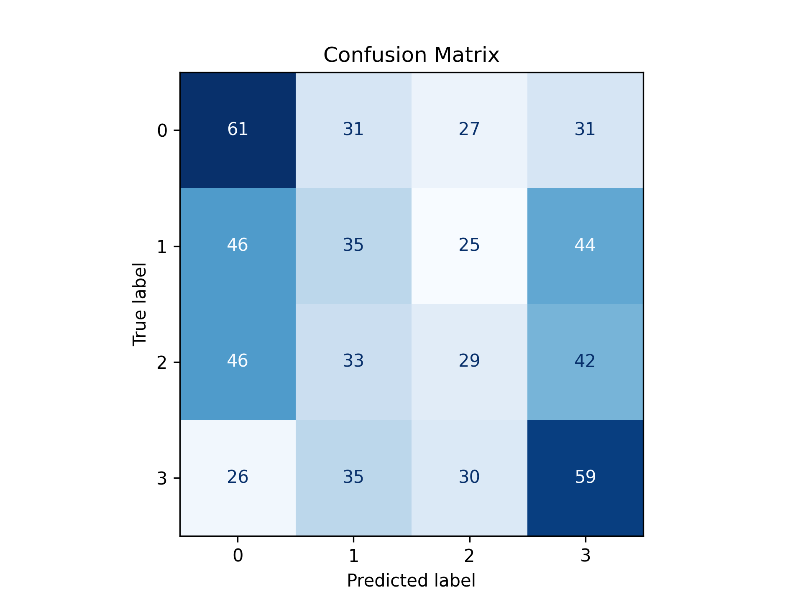
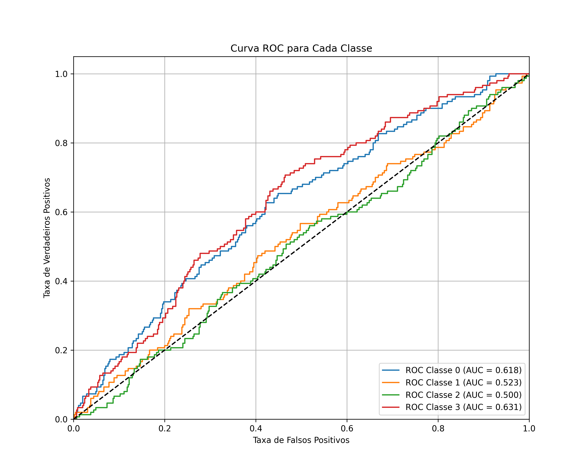

# Mobile price classification
##  Objetivo
Treinar modelos de classificação em Machine Learning utilizando a base de dados do Kaggle [Mobile price classification](https://www.kaggle.com/datasets/iabhishekofficial/mobile-price-classification). O projeto envolve a realização de experimentos, a coleta sistemática de resultados e a análise comparativa de diferentes métricas de avaliação.
## A base de dados
A base de dados contém 2 mil linhas de dados sem colunas faltantes com os atributos descritos a seguir:
- **battery_power**: Energia total que a bateria pode armazenar em uma carga (mAh).  
- **blue**: Possui Bluetooth ou não.  
- **clock_speed**: Velocidade em que o processador executa instruções.  
- **dual_sim**: Suporte a dois chips SIM.  
- **fc**: Resolução da câmera frontal (MP).  
- **four_g**: Suporte a 4G.  
- **int_memory**: Memória interna (GB).  
- **m_dep**: Espessura do celular (cm).  
- **mobile_wt**: Peso do celular (g).  
- **n_cores**: Número de núcleos do processador.  
- **pc**: Resolução da câmera principal (MP).  
- **px_height**: Resolução vertical da tela (pixels).  
- **px_width**: Resolução horizontal da tela (pixels).  
- **ram**: Memória RAM (MB).  
- **sc_h**: Altura da tela (cm).  
- **sc_w**: Largura da tela (cm).  
- **talk_time**: Duração máxima de uma carga de bateria em conversação.  
- **three_g**: Suporte a 3G.  
- **touch_screen**: Possui tela sensível ao toque.  
- **wifi**: Suporte a Wi-Fi.  

### Variável-Alvo
- **price_range**: Categoria de preço do celular  
  - `0`: baixo custo  
  - `1`: custo médio  
  - `2`: custo alto  
  - `3`: custo muito alto
### Observação Importante
A base de dados utilizada é **apenas o arquivo `train.csv`**, pois o arquivo `test.csv` disponibilizado no Kaggle **não contém a coluna da variável-alvo (`price_range`)**, impossibilitando o treinamento ou a avaliação direta dos modelos sobre ele.

## Correlação de Pearson
Abaixo está a matriz de correlação entre as variáveis:


## Metodologia

1. **Divisão da base de dados**  
   - Foi realizada utilizando `train_test_split` com 70% dos dados para o conjunto de treinamento e fazendo uso do parâmetro `stratify=y`, garantindo a preservação da proporção das classes na separação entre treino e teste.  

2. **Pré-processamento**  
   - Aplicado **StandardScaler** para normalização dos atributos, melhorando a estabilidade numérica e o desempenho dos algoritmos de classificação.  

3. **Definição do Modelo MLP**  
   - O classificador escolhido foi um **MLP (Multilayer Perceptron)** definido de forma empírica, após experimentação de diferentes configurações:  

```python
mlp = MLPClassifier(
    hidden_layer_sizes=(4),  # melhor desempenho usando todos os atributos
    activation='tanh',       # função de ativação com melhor resultado
    solver='adam',
    alpha=0.001,
    learning_rate='adaptive',
    max_iter=2000,           # abaixo de 1000 gera warning de não convergência
    random_state=28,         # semente fixa
    verbose=False
)
```

### Validação Cruzada
Todos os experimentos foram avaliados utilizando **K-Fold Cross Validation** com **5 folds**.  
Essa abordagem garante que cada exemplo da base de dados seja utilizado tanto para treino quanto para teste, aumentando a robustez das métricas obtidas.

```python
# K-Fold Cross Validation com 5 folds
kf = KFold(n_splits=5, shuffle=True, random_state=28)
```

## Experimentos
Fiz 5 experimentos usando diferentes combinações de atributos de acordo com a matriz de correlação

### Primeiro experimento
Aqui, usei todos os 20 atributos para classificar a categoria de preço do celular.





| Class         | Precision | Recall   | F1-score |
|---------------|-----------|----------|----------|
| 0             | 0.986395  | 0.966667 | 0.976431 |
| 1             | 0.941558  | 0.966667 | 0.953947 |
| 2             | 0.959459  | 0.946667 | 0.953020 |
| 3             | 0.973510  | 0.980000 | 0.976744 |
| **Macro Avg** | 0.965231  | 0.965000 | 0.965036 |

**Model Accuracy:** 96.5%

---
### Segundo experimento
Aqui, usei os atributos `battery_power`, `ram`, `px_height`, `px_width` durante o treinamento do modelo





| Class        | Precision | Recall   | F1-score |
|--------------|-----------|----------|----------|
| 0            | 0.986207  | 0.953333 | 0.969492 |
| 1            | 0.935484  | 0.966667 | 0.950820 |
| 2            | 0.950000  | 0.886667 | 0.917241 |
| 3            | 0.912500  | 0.973333 | 0.941935 |
| **Macro Avg**| 0.946048  | 0.945000 | 0.944872 |

**Model Accuracy:** 94.5%

---
### Terceiro experimento
Aqui, usei os atributos `battery_power` e `ram` durante o treinamento do modelo





| Class        | Precision | Recall   | F1-score |
|--------------|-----------|----------|----------|
| 0            | 0.893333  | 0.893333 | 0.893333 |
| 1            | 0.760274  | 0.740000 | 0.750000 |
| 2            | 0.745098  | 0.760000 | 0.752475 |
| 3            | 0.887417  | 0.893333 | 0.890365 |
| **Macro Avg**| 0.821531  | 0.821667 | 0.821544 |

**Model Accuracy:** 82.2%

---
### Quarto experimento
Aqui, usei apenas o atributo `ram` durante o treinamento do modelo visto que ele possui uma correlação de 0.91 com a variável alvo





| Class        | Precision | Recall   | F1-score |
|--------------|-----------|----------|----------|
| 0            | 0.823899  | 0.873333 | 0.847896 |
| 1            | 0.704545  | 0.620000 | 0.659574 |
| 2            | 0.691781  | 0.673333 | 0.682432 |
| 3            | 0.828221  | 0.900000 | 0.862620 |
| **Macro Avg**| 0.762112  | 0.766667 | 0.763131 |

**Model Accuracy:** 76.7%

---
### Quinto experimento
Para o quinto e último experimento, usei todos os atributos exceto a `ram` para avaliar se o modelo manteria um bom desempenho apenas com os atributos de menor correlação.





| Class        | Precision | Recall   | F1-score |
|--------------|-----------|----------|----------|
| 0            | 0.340782  | 0.406667 | 0.370821 |
| 1            | 0.261194  | 0.233333 | 0.246479 |
| 2            | 0.261261  | 0.193333 | 0.222222 |
| 3            | 0.335227  | 0.393333 | 0.361963 |
| **Macro Avg**| 0.299616  | 0.306667 | 0.300371 |

**Model Accuracy:** 30.7%

## Conclusões

Os resultados dos experimentos indicam que a variável **`ram`** é extremamente relevante para a predição do preço dos celulares na base utilizada.  

- Nos **quatro primeiros experimentos**, nos quais `ram` foi incluída como atributo, o modelo apresentou desempenho **bom a muito bom**, com uma boa acurácia e métricas de precisão, recall e F1-score consistentes entre as classes.  
- No **quinto experimento**, onde todos os atributos foram utilizados **exceto `ram`**, o desempenho do modelo caiu drasticamente, com acurácia aproximada de 31% e métricas de classificação muito baixas, demonstrando que os atributos restantes, com menor correlação com a variável-alvo, não são suficientes para uma predição confiável.  

## Como Rodar

Na pasta **`dataset`** estão os arquivos utilizados no projeto:

- **`mobile_price_classification_dataset.csv`** – Base de dados principal contendo os atributos dos celulares e a variável-alvo `price_range`.  
- **`variable_info.txt`** – Descrição das variáveis e seus significados, utilizada como referência para interpretação dos dados.

O código principal do projeto está no arquivo **`main.ipynb`**. Ele depende de três funções auxiliares definidas na pasta `functions`:  

- **`correlation.py`** – Funções para cálculo e plot da matriz de correlação.  
- **`roc_curve.py`** – Funções para geração das curvas ROC por classe.  
- **`split_dataset.py`** – Funções para divisão da base com estratificação.
  
