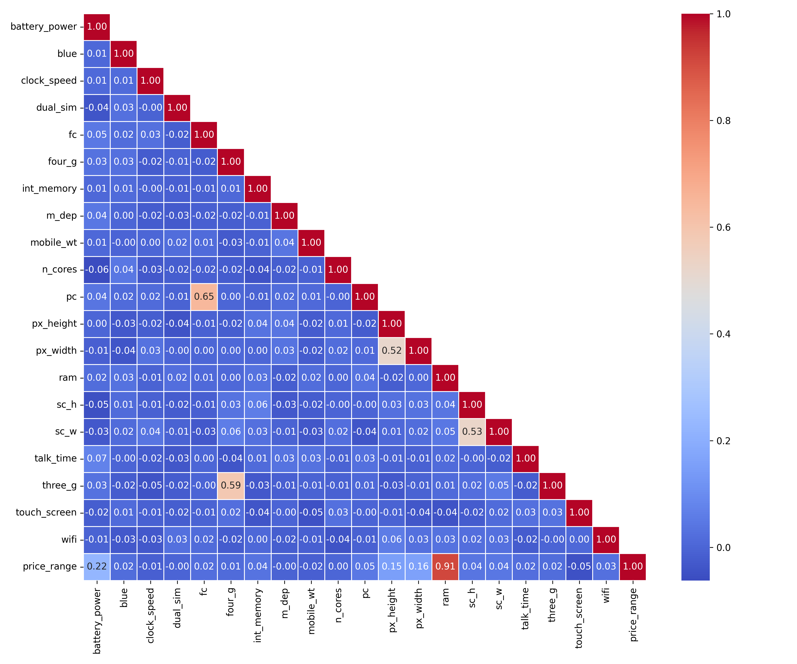

# Mobile-price-classification
##  Objetivo
Treinar modelos de classificação em Machine Learning utilizando a base de dados do Kaggle [Mobile price classification](https://www.kaggle.com/datasets/iabhishekofficial/mobile-price-classification). O projeto envolve a realização de experimentos, a coleta sistemática de resultados e a análise comparativa de diferentes métricas de avaliação.
## A base de dados
A base de dados contém 2 mil linhas de dados sem colunas faltantes com os atributos descritos a seguir:
- **battery_power**: Energia total que a bateria pode armazenar em uma carga (mAh).  
- **blue**: Possui Bluetooth ou não.  
- **clock_speed**: Velocidade em que o processador executa instruções.  
- **dual_sim**: Suporte a dois chips SIM.  
- **fc**: Resolução da câmera frontal (MP).  
- **four_g**: Suporte a 4G.  
- **int_memory**: Memória interna (GB).  
- **m_dep**: Espessura do celular (cm).  
- **mobile_wt**: Peso do celular (g).  
- **n_cores**: Número de núcleos do processador.  
- **pc**: Resolução da câmera principal (MP).  
- **px_height**: Resolução vertical da tela (pixels).  
- **px_width**: Resolução horizontal da tela (pixels).  
- **ram**: Memória RAM (MB).  
- **sc_h**: Altura da tela (cm).  
- **sc_w**: Largura da tela (cm).  
- **talk_time**: Duração máxima de uma carga de bateria em conversação.  
- **three_g**: Suporte a 3G.  
- **touch_screen**: Possui tela sensível ao toque.  
- **wifi**: Suporte a Wi-Fi.  

### Variável-Alvo
- **price_range**: Categoria de preço do celular  
  - `0`: baixo custo  
  - `1`: custo médio  
  - `2`: custo alto  
  - `3`: custo muito alto
### Observação Importante
A base de dados utilizada é **apenas o arquivo `train.csv`**, pois o arquivo `test.csv` disponibilizado no Kaggle **não contém a coluna da variável-alvo (`price_range`)**, impossibilitando o treinamento ou a avaliação direta dos modelos sobre ele.

## Correlação de Pearson
Abaixo está a matriz de correlação entre as variáveis:

